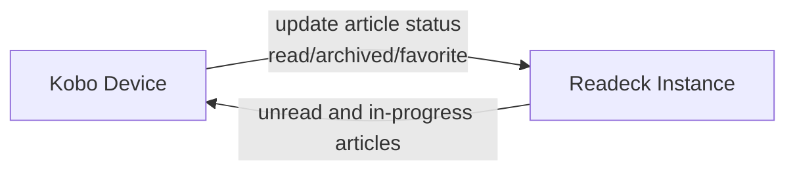

# Kobodeck

[](https://github.com/fkaduk/kobodeck/actions/workflows/ci.yml)
[](https://app.codecov.io/gh/fkaduk/kobodeck)
[](go.mod)
[](https://github.com/fkaduk/kobodeck/releases/latest)
[](LICENSE)

A minimalist Readeck article downloader for Kobo e-readers that

- fetches articles as KEPUBs from a **Readeck instance**
- marks completed articles as read on Readeck, optionally archives them
- synchronizes favorites from the **Kobo device** to Readeck



The project is forked from
[wallabako](https://gitlab.com/anarcat/wallabako).

Kobodeck does not write to the Kobo devices SQLite database.

## Who is this for?

This plugin could be useful for you if you

- do not want to use [KOReader](https://koreader.rocks/), which has a native
  Readeck/OPDS plugin or [Plato](https://github.com/baskerville/plato/), which
  includes an article fetcher
- are ok with mixing ebooks and articles in the native Kobo UI - if you want to
  keep them separate, check out [kobeck](https://github.com/Lukas0907/kobeck)
- are fine with a lack of UI - syncing happens in the background

## How to use it

When Wi-Fi is enabled, Kobodeck downloads Readeck articles
matching the configured filters as KEPUBs.

It then triggers a Nickel library rescan via a simulated USB event.

Press **Connect** to rescan immediately, or **Cancel** -
the files are already downloaded either way.


If you have a large number of articles,
increase the automatic sleep timeout under
**Settings → Energy savings and privacy → Automatically go to sleep after**
to prevent Kobodeck from being suspended.

## Prerequisites

- a running [hosted](https://readeck.com) or
  [self-hosted](https://readeck.org/en/) Readeck instance (latest)
- a Readeck API token (generate in Readeck under Settings → API tokens)
- a Kobo device running the stock Nickel firmware
  (tested on Kobo Libra Colour; other Glo-generation and newer devices may work
  but are not officially supported)

## Install or upgrade

To install or upgrade

1. obtain the latest `KoboRoot.tgz`:
   - download it from the releases page, or
   - build from source via `make tarball`
1. save the file in the `.kobo` directory of your e-reader
1. copy and edit the configuration file [`kobodeck.toml`](kobodeck.toml)
1. store it as `.adds/kobodeck/kobodeck.toml` on your Kobo device
1. optionally verify your configuration with
   `kobodeck --config .adds/kobodeck/kobodeck.toml --check`
   via the binary provided in the tarball
1. safely disconnect the reader - it should restart, install Kobodeck and remove
   `KoboRoot.tgz`

Logs are written to `.adds/kobodeck/kobodeck.log` on the device.

### Output directory and deletion

`Output.Path` must be a directory dedicated to Kobodeck downloads. Kobodeck
treats every top-level `*.kepub.epub` in that directory as a Readeck article,
using the filename without `.kepub.epub` as the bookmark ID.

When `Output.Delete` is enabled, Kobodeck deletes those files if they are absent
from the current fetched feed. This includes articles excluded by `Fetch.Labels`,
`Fetch.Status`, or `Fetch.Limit`. Do not enable deletion for a directory that
contains unrelated books.

## Uninstall

Empty the file `.adds/kobodeck/kobodeck.toml`
(delete its contents, but keep the file) and connect to Wi-Fi.
Kobodeck will remove the installed files,
without deleting downloaded articles,
and exit.
If uninstall succeeded, `.adds/kobodeck/` will no longer exist.

### Manual uninstall

Manual removal requires root access to the device.
The following need to be deleted:

```text
/etc/udev/rules.d/90-kobodeck.rules
/usr/local/bin/kobodeck
/mnt/onboard/.adds/kobodeck/
/mnt/onboard/kobodeck/
```

The last path is the default article output directory
(`Output.Path` in the config) - adjust if you changed it.

## Development

Check the Makefile for common operations.

### Testing

Most synchronization behavior is covered by native Go tests.
One end-to-end smoke test simulates a Kobo device in an ARMv7 QEMU VM
with FAT32 storage and executes Kobodeck against a real Readeck instance.

Run the native tests with `make test`.

To run the end-to-end test, install the necessary dependencies
(QEMU, Docker, `cpio`, `dosfstools`, and `mtools`)
and execute `make test-e2e`.
The test intentionally uses `readeck:latest` to catch compatibility problems
with the version users are most likely to deploy.

### Known issues and limitations

#### Conversion chain

The reading experience of KEPUBs on Kobo devices is much better
than for normal EPUBs (faster page turns, reading statistics).

However, for a web article to arrive on a Kobo device requires
at least 2 conversions, which by their nature are pretty messy:

1. HTML → EPUB by Readeck
1. EPUB → KEPUB by
   [`kepubify`](https://github.com/pgaskin/kepubify)

Readeck currently produces an
[EPUB 2.0 package](https://codeberg.org/readeck/readeck/src/commit/bc07420052df/pkg/epub/types.go#L107-L112)
whose
[XHTML content template](https://codeberg.org/readeck/readeck/src/commit/bc07420052df/internal/bookmarks/converter/x-epub.templ#L21-L24)
also uses
[HTML5 and EPUB 3 constructs](https://codeberg.org/readeck/readeck/src/commit/bc07420052df/internal/bookmarks/converter/x-epub.templ#L69-L89).
Kobodeck does not normalize this hybrid markup. Before running `kepubify`, it
only patches the package metadata to designate the first suitable article
image or the favicon as the cover.

Kobodeck downloads the source EPUB to a temporary file in `Output.Path`. It
converts into another same-directory temporary file, syncs and validates that
KEPUB, then atomically renames it into place. A failed or interrupted conversion
therefore does not replace an existing KEPUB, and an invalid installed KEPUB is
redownloaded instead of being treated as complete. The temporary source EPUB is
removed after both successful and failed conversions, so it is not retained for
debugging or a later retry.

Possible improvements:

- Normalize Readeck's EPUB 2/HTML5 hybrid output into a consistent EPUB 3 book
  and validate representative output with
  [EPUBCheck](https://www.w3.org/publishing/epubcheck/) in CI. But this might be
  better fixed upstream.
- Improve cover selection, for example by preferring the lead or largest image,
  and optionally generate a fallback cover.
- Option to preserve the downloaded EPUB when KEPUB conversion fails.

#### Synchronization

- Valid downloaded articles are not refreshed when their Readeck content
  changes. Invalid local KEPUBs are redownloaded automatically.
  To force a re-download, delete the file from `Output.Path`.
- If you enable `Sync.FavouriteCollection` in Kobodeck, the respective
  collection will serve as ground truth and will override changes
  made to your favorites e.g. via the Readeck web interface.
- Highlights, notes, annotations, in-progress percentage and reading positions
  are not synchronized from the Kobo device to Readeck.
- There are no options to fetch archived articles or favorites only.
